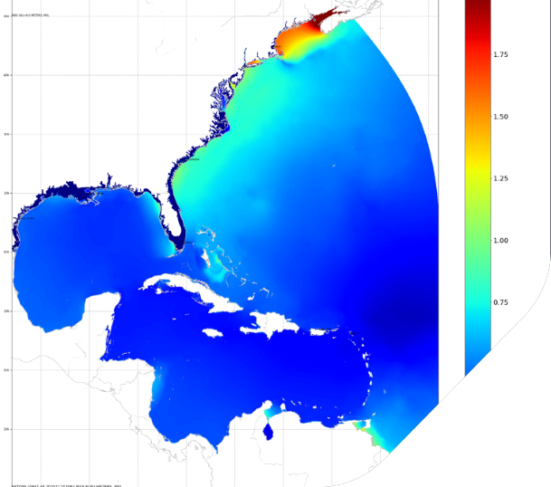

# NOAA Coastal Ocean Reanalysis (CORA)

RPS worked with the CORA group to optimize this very large dataset for cloud-based access.

[**Notebooks**](https://github.com/asascience/ncdis)

Atlantic reanalysis
- HSOFS mesh (~1.8 million nodes)
- 40 years of hourly data every 500m along the coast, including within bays, estuaries, and coastal river mouth entrances
- ~70 TB of storage

Pacific reanalysis
- GSTOFS mesh (~450k-2.2m nodes)
- Resolution down to 80m for Hawaii and US West Coast
- 90-120m for Pacific Islands 
- ~300 TB of storage 

## Applying Kerchunk

After applying kerchunk to cloud-optimize the data, we were able to perform the following analysis:

| Function | Optimized | Original |
| ---------| ----------| -------- |
| Month long time-series | 2 s | ?? |
| Get 141 annual time series | 3 min | 30 min |
| Daily max water level | 6 s | >90 min |