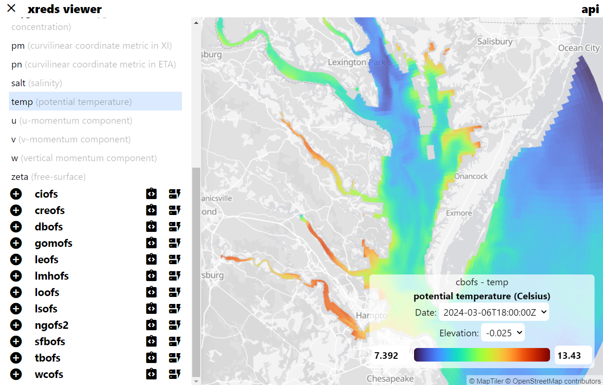

# Application Data Access

Open access to data implies that a user can both physically access the data, interpret it, and use that data for further research. One challenge in the geoscience community has been making that data accessible in a true on-demand environment due to the cost and complexity of processing that data.

Modern data access patterns tend to provide an Application Programming Interface (API) that serves both internal and external applications. Rather than expose raw data files or tables to consumers, these APIs provide views of the data. The current de-facto APIs serving NOAA data are THREDDS and ERDDAP. Unfortunately the current implementations serving this data are were not engineered with cloud-native design in mind and struggle to scale to the needs of modern data services.

## Cloud-Native Prototype APIs

Our initial work on this topic started at the 2022 IOOS Code sprint with RESTful Grids. We extended [XPublish](https://xpublish.readthedocs.io/en/latest/) which is a simple web server using the [xarray](https://docs.xarray.dev/en/stable/) data model. Rather than force all clients to implement various APIs, each XPublish API can serve on its own or in parallel with others.

- [XREDS](https://github.com/asascience-open/xreds): Xarray Environmental Data Services
- [RESTful Grids](https://github.com/asascience/restful-grids): Exploring modern RESTful services for gridded data
- [XPublish OpenDAP](https://github.com/xpublish-community/xpublish-opendap): OpenDAP implementation
- [XPublish EDR](https://github.com/xpublish-community/xpublish-edr): Environmental Data Retrieval API
- [XPublish WMS](https://github.com/xpublish-community/xpublish-wms): Web Mapping Service API

## Demonstration

These APIs, backed with an Analysis-Ready Cloud-Optimized (ARCO) dataset in the cloud, provide users with access to the dataset information and the ability to select tiles directly from the data. This image is demonstrating a view of the GFS with its variables, plus a rendering of the selected one. We are able to dynamically load these views using a simple Python backend and a React frontend.

