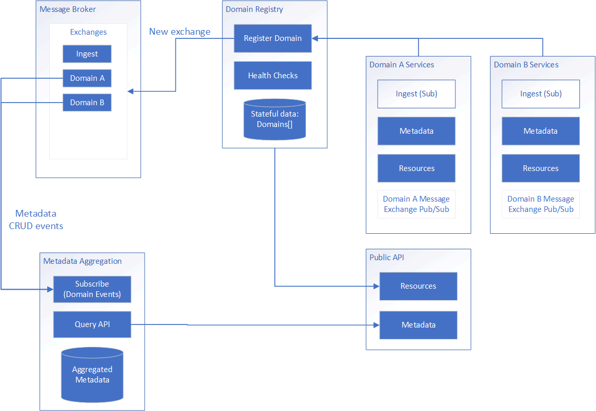

# System Architecture

The system architecture is the high-level view of how all of the capabilities enabled by the prototypes tie together to produce a working system of interdependent components.

The problems this design addresses are:

- How will the system be flexible enough to handle many different kinds of data? [(Domain Services)](#domain-services)
- How do we get new data into the system? [(Data Ingest)](#ingest)
- How can we get an aggregate view of all available data across many different domains? [(Metadata)](#metadata)
- How do we tie together different data formats and conventions into one common view? [(Resources)](#resources)
- What are some tools and services we can produce to make it simple to set up a new domain? [(Implementation)](#domain-implementation)

> [Conway's Law](https://en.wikipedia.org/wiki/Conway%27s_law): Any organization that designs a system (defined broadly) will produce a design whose structure is a copy of the organization's communication structure.

## Methodology

The goal of this system architecture is to decompose domains and make important information accessible through a common interoperable framework. This allows each domain to own its implementation while tying together the overall system. For example, a forecast model would be its own domain while buoy observations would be another. The forecast model might be stored in a NetCDF archive while the observations are in a time-series database. All domains are responsible for reporting their available data to the system, but otherwise their functions for data retrieval, ingest, and archiving are completely independent for maximum flexibility.

## Architecture Diagram

## Domain Services

The primary functions of the system are executed within domains. Each domain is responsible for its own data ingest, metadata extraction, and resource availability. A domain can theoretically be any combination of components as long as it adheres to the domain interface. Domains communicate with the rest of the system through the exchanges to ensure loose coupling and independent responsibility.

### Ingest

The ingest is the method in which the domains become aware of new data. Each domain is responsible for reading data from the ingest exchange and determining what is appropriate for that domain or not.

### Metadata

Metadata will need to be served in a standard JSON format from each domain. The system does not enforce standards or compliance; it simply returns what each domain is providing. It is the domain's responsibility to provide compliant metadata.

Metadata may be queried globally across all domains or limited to specified domains. 

Domains must track which metadata is associated with what data products.

#### Metadata Aggregation

In order to view the available data across the system, an aggregation service will report the entire system's metadata from all domains. It will keep the aggregations up-to-date by subscribing to the domain exchange's metadata events.

### Resources

Resources describe the data endpoints that are available for consumers to use. Because of the varied nature of the raw data, resources simply describe where to retrieve data. How to retrieve that data is up to the consumer because each resource's API may be different. Resources for an observation dataset may simply be a connection URL to a time series database. Resources for a forecast model may be a URL to a set of data files and/or an OpenDAP endpoint.

One challenge of this approach will be ensuring that resources are accessible to consumers. Just because a URL is returned doesn't ensure that the endpoint is reachable.

Metadata connection is also a resource so that the metadata database can be queried directly without us writing our own query services.

## Domain Implementation

Templates can be developed to make setting up a new domain relatively simple. Templated capabilities may include:

- A document database for storing metadata
- Harvesting functions for metadata from a variety of standard file formats (e.g. netcdf, grib)
- Ingest workflow (e.g. Prefect template) and extensible services
- Configurable API services
- Messaging exchange publish/subscribe mechanisms
- Infrastructure provisioning
- Configuration tools

## Domain Registry

The domain registry is a stateful component that tracks each of the domains in the system. Domains are responsible for their own registration, and in return the domain registry monitors the health of domains and reports any problems. Once registered, domain functions are available to consumers.

## Message Broker

The message broker is the controller for sending and receiving events throughout the system, as described in the [Event Messaging](../ingest/events.md) section. The broker can host many exchanges (channels where messages are sent and received). 

- Ingest: Describes new data files available to be ingested into the appropriate domain
- Domain: Each domain creates a new exchange for sending and receiving of its own messages.

Within an exchange, messages can be differentiated by Topic.

### Events

The system is event-driven. The purpose the messaging exchange is to publish state change events to external consumers.

The following events are required to be implemented:

- New metadata (JSON string of new metadata)
- Data Product
- Log events

These events will be listened to by additional services such as a metadata aggregation service.