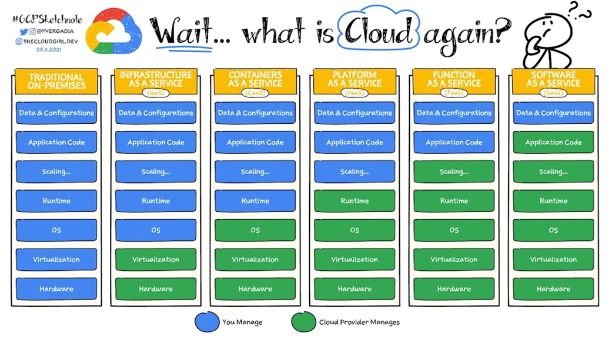
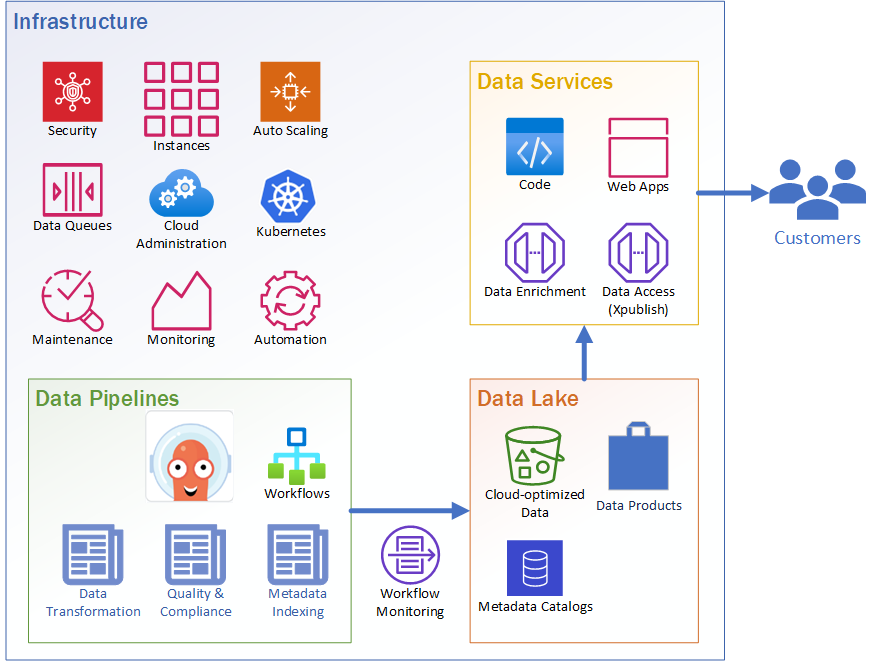

# Considerations

The primary consideration when choosing a cloud infrastructure platform mainly is how much control one wants over fine details of the system, and therefore how much responsibility the organization is willing to own in maintaining that infrastructure. The spectrum of choices is highlighted in this diagram:

Generally, Traditional On-Premises will cost the most since the organization will need to fund the entire stack plus operations, whereas cloud providers are able to amortize that investment across many customers and charge fees for resource usage. This isn't necessarily a linear comparison and depends highly on the use-case as to which architecture is right for the application. For example, a very heavily used Function-as-a-Service may incur significant costs, and in that case might be better running on a dedicated machine using Containers-as-a-Service. There are also limitations using Functions or Platforms such as maximum memory or network bandwidth, so some solutions necessitate more management. This is really more of a spectrum of choices for each solution rather than a one-size-fits-all decision for the entire organization. 

Consider "the cloud" as an IT infrastructure, with computational resources available to rent. As part of that rental fee, the provider keeps all managed resources updated, secure, and available. For example, allocating a virtual machine (Infrastructure-as-a-Service) will still require an operating system maintenance plan by local IT staff. However, opting to manage just containers (Containers-as-a-Service) now only requires that the container images are scanned and updated, which can be performed offline without impacting the operational system. Moving up the stack, Function-as-a-Service only requires that the source code is updated, but regular system administration is handled behind the scenes by the cloud provider.

## Recommendations

Each of the 11 Regional Associations (RAs), as part of NOAA-IOOS, operate independent infrastructure to process, store, and serve their data. The RAs mainly operate Traditional On-Premises and Infrastructure-as-a-Service (such as VMWare) configurations. Several RAs run services in the cloud, and the cloud providers used vary.

