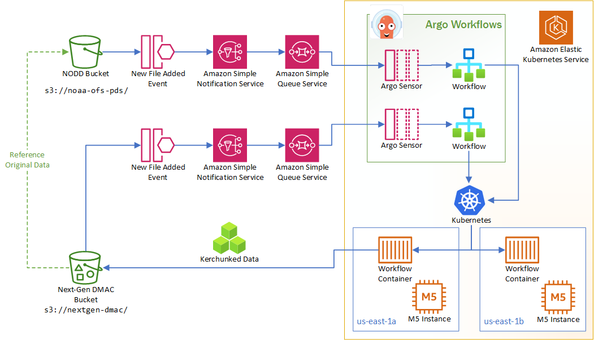

# Argo Kerchunk Workflow

[Source Code and Technical Documentation](https://github.com/asascience-open/nextgen-dmac/tree/main/kerchunk)

The data ingest prototype starts by listening to events from the NODD bucket when new files are added. This kicks off an SNS notification, which is then queued in SQS. The reason for doing this is so that all messages can be received and read even if there might not be a listener ready exactly when the notification is generated.

Argo has Sensors which listen to the queue. Those sensors generate an Argo workflow when the appropriate message is read from the queue. That workflow is scheduled as a Kubernetes pod which runs a custom Python script to kerchunk the new NODD file.

The kerchunked data is written to the public Next-Gen DMAC bucket. Note that the kerchunked data is a reference to the NODD data, not a copy, so the NODD data must remain available for the kerchunk reference to work. 

The same listener pattern is applied to the Next-Gen DMAC bucket: when new files are added, it generates events that go into a queue, and a different sensor kicks off a workflow to produce the "best forecast" kerchunk for the 30 days of available data. 

This is all running on AWS Elastic Kubernetes Service, with virtual machines running in 2 availability zones (us-east-1a and us-east-1b) which improves system uptime as the system can continue to function if one of the zones goes down. 