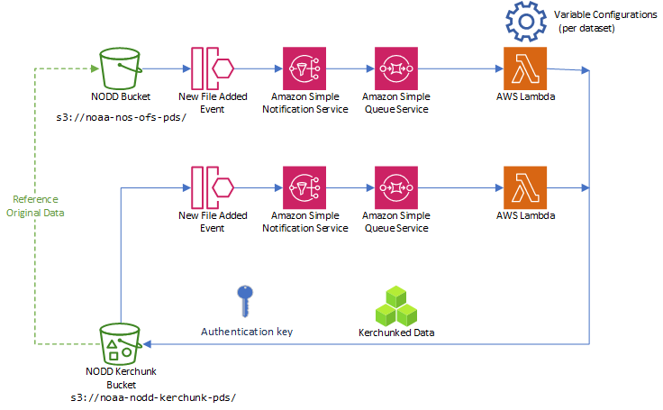

# Lambda Kerchunk Workflow

[Source Code and Technical Documentation](https://github.com/asascience-open/nextgen-dmac/tree/main/cloud_aggregator)

The data ingest prototype starts by listening to events from the NODD bucket when new files are added. This kicks off an SNS notification, which is then queued in SQS. The reason for doing this is so that all messages can be received and read even if there might not be a listener ready exactly when the notification is generated.

The Lambda functions are triggered when new messages arrive in the SQS queue. A Lambda function creates a temporary virtual machine running the Docker image we built, which executes our custom Python code. This Python code kerchunks the appropriate files and then writes the index zarr files to the destination S3 bucket.

The kerchunked data is written to the public Cloud--Optimized DMAC bucket. Note that the kerchunked data is a reference to the NODD data, not a copy, so the NODD data must remain available for the kerchunk reference to work. 

The same listener pattern is applied to the destination bucket: when new files are added, it generates events that go into a queue, and the `aggregation` Lambda kicks off a workflow to produce the "best forecast" kerchunk for the available data, and the entire model run (1 cycle) as one reference file. 