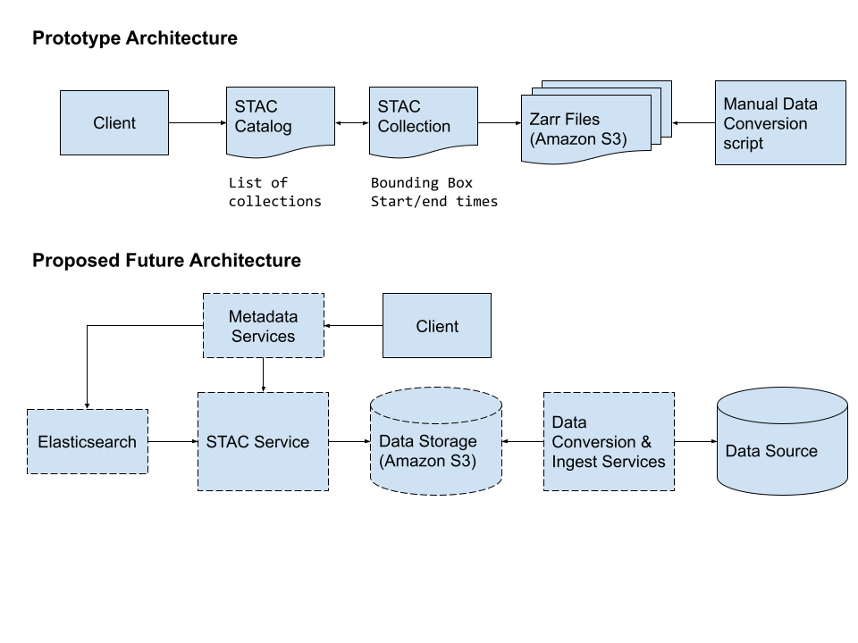

# Metadata Catalog

Support for a standardized metadata catalog provides visibility into the data for both internal and external purposes. Publishing metadata in a standard format helps downstream consumers understand the metadata structure and consume the data in a consistent manner. 

## Spatio-Temporal Asset Catalog (STAC)

The [Spatio-Temporal Asset Catalog (STAC)](https://stacspec.org/en) is a new [Open Geospatial Consortium (OGC)](https://www.ogc.org/taxonomy/term/848) standard for representing large datasets in the cloud. It is published metadata that can be read by consumers to quickly understand what data is available. STAC is decentralized metadata so each dataset publishes its own STAC descriptions.

> The goal is for all providers of spatiotemporal assets (Imagery, SAR, Point Clouds, Data Cubes, Full Motion Video, etc) to expose their data as SpatioTemporal Asset Catalogs (STAC), so that new code doesn't need to be written whenever a new data set or API is released. ([STAC Vision Statement](https://stacspec.org/en))

The use of STAC for scientific data has been limited so far. Pangeo has had [some discussions on it](https://discourse.pangeo.io/t/stac-and-earth-systems-datasets/1472/17) and many members of the community are experimenting with their own STAC catalogs. There has been some work [developing STAC extensions for data cubes](https://github.com/stac-extensions/datacube) to better describe gridded data dimensions. Most notably, [Microsoft has adopted STAC](https://planetarycomputer.microsoft.com/docs/concepts/data-catalog/) for their Planetary Computer.

## Architectural Design

One benefit of the STAC specification is that each metadata component can be described independently. At a high level, all collections are part of the same catalog, but each collection and all items can update independently. 

The STAC API can be a facade for client access. Web services can generate the appropriate STAC metadata from an optimized database.

To make the catalog searchable, an Elasticsearch client can ingest and index the STAC metadata.

